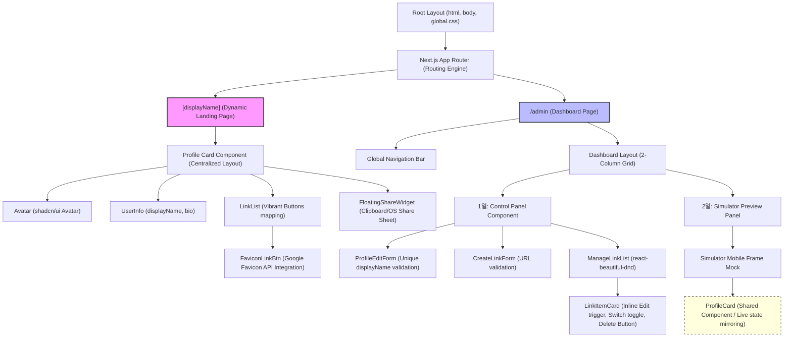
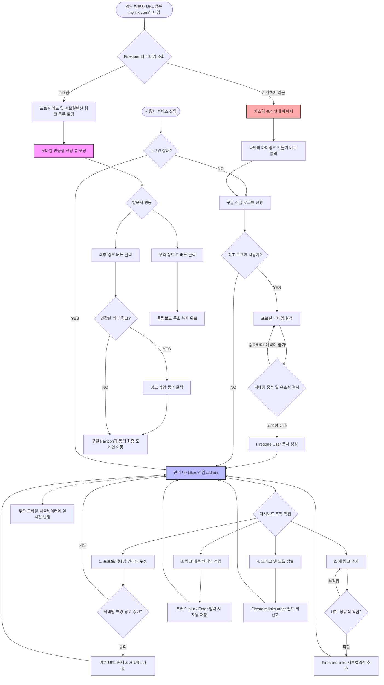

# [와이어프레임] 링크트리 클론 서비스 "마이링크 (MyLink)"

본 문서는 마이링크 서비스의 UI 컴포넌트 설계 및 레이아웃 와이어프레임(Wireframe) 기획서입니다. **ASCII 아트 기반의 목업(Mockup)**과 **Mermaid 컴포넌트 트리 및 플로우차트**를 통하여 시각적인 작동 방식을 명확히 제시합니다.

---

## 1. 모바일 프로필 랜딩 페이지 (`mylink.com/[displayName]`)

사용자가 퍼블릭에 노출하는 모바일 세로형 레이아웃의 랜딩 페이지입니다.

### 1.1 UI 컴포넌트 세부 명세
1. **공유/복사 플로팅 버튼 `[🔗]`**: 화면 우측 상단 고정 위치. 클릭 시 클립보드 복사 알림 및 모바일 공유 시트를 호출합니다.
2. **프로필 아바타 `( Avatar )`**: 중앙 배치. 구글 프로필 이미지(`photoURL`)를 실시간 매핑하며, 부재 시 사용자의 `displayName` 첫 글자로 텍스트 아바타(shadcn UI Fallback)를 렌더링합니다.
3. **표시 이름 `[displayName]`**: 타이틀 크기로 중앙 정렬 표출됩니다.
4. **한 줄 소개 `[bio]`**: 서브타이틀 크기로 중앙 정렬 표출됩니다.
5. **링크 버튼 리스트**:
   - `[🌐]` **구글 API 연동 파비콘**: 등록된 URL 도메인에서 구글 API를 이용하여 파비콘을 실시간 렌더링(좌측 고정 배치).
   - **링크 타이틀 & 호버 애니메이션**: 사용자가 지정한 링크 제목이 노출되며, 마우스 호버 시 지정된 피드백 애니메이션(예: 바운스)을 실행합니다.

### 1.2 모바일 랜딩 페이지 ASCII 와이어프레임

```text
=====================================================
|                    [ MOBILE ]                     |
=====================================================
|                                                   |
|   +-------------------------------------------+   |
|   |  [ MyLink ]                         [🔗]  |   | <--- [🔗] 우측 상단 공유/복사 버튼
|   |                                           |   |
|   |                (  Avatar  )               |   | <--- 구글 이미지 또는 이니셜
|   |                                           |   |
|   |                  홍길동                   |   | <--- displayName (닉네임)
|   |         Next.js 테크 크리에이터           |   | <--- bio (한 줄 소개)
|   |                                           |   |
|   |   +-----------------------------------+   |   |
|   |   | [🌐]  내 개인 포트폴리오 사이트   |   |   | <--- [🌐] 도메인 기반 구글 API 파비콘
|   |   +-----------------------------------+   |   |
|   |                                           |   |
|   |   +-----------------------------------+   |   |
|   |   | [🐙]  공식 깃허브 (GitHub)        |   |   |
|   |   +-----------------------------------+   |   |
|   |                                           |   |
|   |   +-----------------------------------+   |   |
|   |   | [📺]  유튜브 채널 구독하기        |   |   |
|   |   +-----------------------------------+   |   |
|   |                                           |   |
|   |                                           |   |
|   |              [ Made by MyLink ]           |   |
|   +-------------------------------------------+   |
|                                                   |
=====================================================
```

---

## 2. 관리 대시보드 페이지 (`mylink.com/admin`)

소유자가 가입 후 본인의 프로필 및 링크 카드를 관리하는 2열 분할식 반응형 대시보드 화면입니다.

### 2.1 UI 컴포넌트 세부 명세
1. **네비게이션 바**: 마이링크 로고, 사용자 프로필, 로그아웃 버튼을 탑재합니다.
2. **1열: 링크 및 프로필 설정 패널 (좌측)**
   - **프로필 설정 영역**: 본인의 닉네임(`displayName`) 및 소개글(`bio`)을 입력하고 수정하는 폼.
   - **새 링크 추가 폼**: 링크의 제목과 타겟 URL 주소를 입력하여 추가하는 단일 카드 폼.
   - **링크 관리 리스트 (인라인 편집 & 드래그 앤 드롭)**:
     - `[::]` **드래그 핸들**: 링크 순서 조정을 위해 잡고 위아래로 끌어놓을 수 있는 영역.
     - **인라인 수정 필드**: 각 링크의 텍스트 클릭 시 즉시 인풋창으로 변환되어 현장 수정 가능.
     - `[o]` / `[x]` **노출 토글**: 클릭 시 즉각적으로 랜딩 페이지 노출 활성/비활성 처리.
     - `[🗑]` **삭제 버튼**: 링크 데이터를 실시간 안전하게 제거(2차 컨펌창 호출).
3. **2열: 실시간 모바일 랜딩 뷰 미리보기 (우측)**
   - 좌측에서 편집 중인 데이터가 반영되어 최종 사용자 랜딩 뷰와 100% 일치하게 미러링 렌더링되는 시뮬레이터 창입니다.

### 2.2 관리 대시보드 페이지 ASCII 와이어프레임

```text
==================================================================================================
|                                      [ MYLINK ADMIN DASHBOARD ]                                |
==================================================================================================
| [마이링크 로고]                                                          [홍길동 님] [로그아웃]  | <--- GNB
==================================================================================================
|  [ 1열: 링크 및 프로필 관리 패널 ]               |  [ 2열: 실시간 모바일 미리보기 패널 ]        |
|                                                  |                                             |
|  * 프로필 정보 수정                              |  +---------------------------------------+  |
|  +--------------------------------------------+  |  | [ MyLink ]                       [🔗] |  |
|  | 닉네임: [ 홍길동                     ]    |  |  |                                       |  |
|  | 소개글: [ Next.js 테크 크리에이터     ]    |  |  |              (  Avatar  )             |  |
|  | < 프로필 저장 > *변경 시 기존 URL 즉시 해제  |  |  |                                       |  |
|  +--------------------------------------------+  |  |                홍길동                 |  |
|                                                  |  |       Next.js 테크 크리에이터         |  |
|  * 새 링크 추가                                  |  |                                       |  |
|  +--------------------------------------------+  |  |  +---------------------------------+  |  |
|  | 제목: [ 깃허브 바로가기              ]    |  |  |  | [🌐] 내 개인 포트폴리오 사이트 |  |  |
|  | 주소: [ https://github.com/gildong   ]    |  |  |  +---------------------------------+  |  |
|  | < + 신규 링크 등록하기 >                     |  |  |                                       |  |
|  +--------------------------------------------+  |  |  +---------------------------------+  |  |
|                                                  |  |  | [🐙] 공식 깃허브 (GitHub)       |  |  |
|  * 내 링크 목록 (인라인 수정 및 순서 변경)       |  |  +---------------------------------+  |  |
|  +--------------------------------------------+  |  |                                       |  |
|  | [::] [ 🌐 ] [ 인포 사이트          ] [o] [🗑] |  |  |              [ Made by MyLink ]       |  |
|  +--------------------------------------------+  |  +---------------------------------------+  |
|  | [::] [ 🐙 ] [ 인풋창: 공식 깃허브 (Git] [o] [🗑] |  |                                             | <--- 깃허브 항목 더블클릭 시
|  |  * 인라인 편집 활성화 상태 (포커스 blur시 저장) |  |                                             |      대시보드 내 인풋창 자동 렌더링
|  +--------------------------------------------+  |                                             |
|  | [::] [ 📺 ] [ 유튜브 채널 구독하기 ] [x] [🗑] |  |                                             | <--- 비활성화된 항목은 [x] 표시 및
|  +--------------------------------------------+  |                                             |      미리보기 패널에서 즉각 미출력됨
==================================================================================================
```

---

## 3. Mermaid 기반 아키텍처 및 화면 흐름도

컴포넌트의 계층 구조와 사용자가 서비스를 이용하는 핵심 흐름을 가시적으로 나타냅니다.

### 3.1 Next.js 컴포넌트 계층 구조 트리 (Component Tree)



### 3.2 마이링크 유저 스토리 및 라우팅 플로우차트 (Flowchart)


